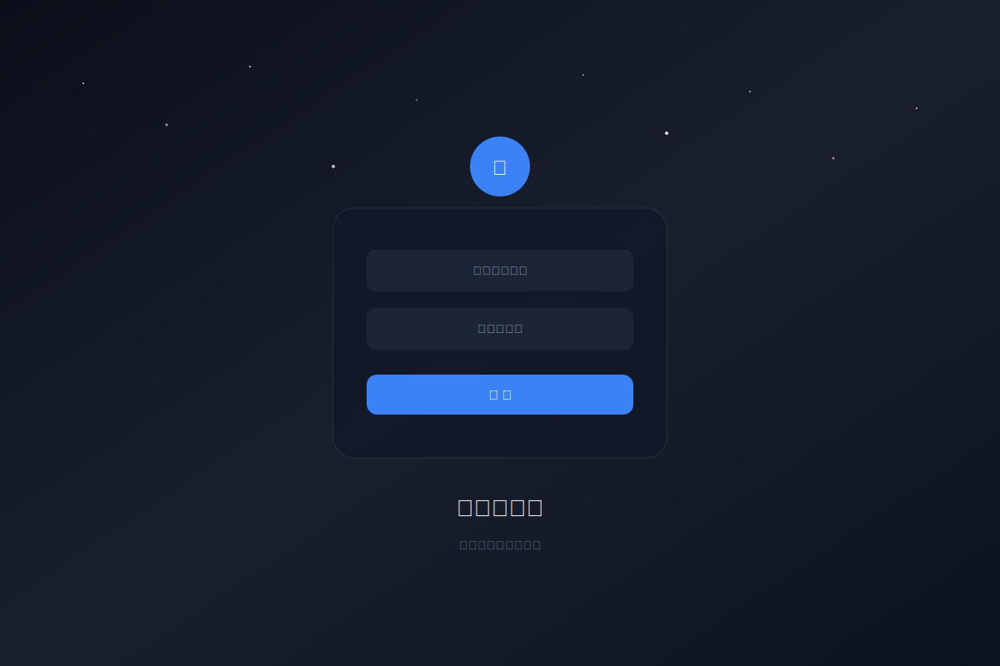
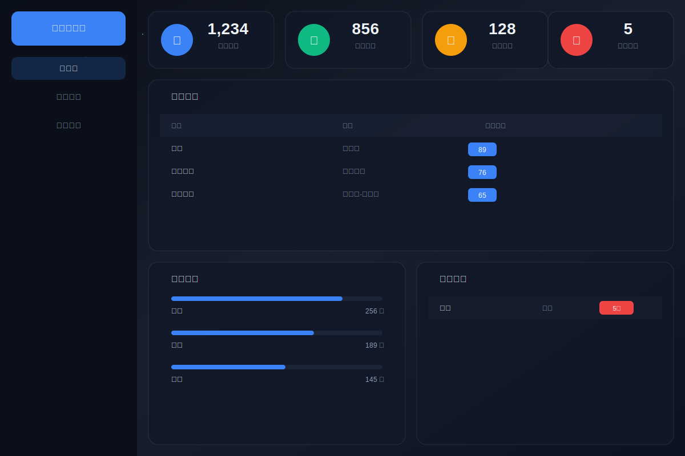

# 🌟 星空图书馆 - Starry Library

一个基于 Vue 3 + Node.js 的现代化图书管理系统，采用"星空图书馆"主题设计，以深蓝黑色为背景，白色星点为装饰，营造沉浸式的阅读氛围。



## ✨ 功能特性

### 📚 核心功能
- **图书管理** - 图书的增删改查、封面上传、分类管理
- **用户管理** - 用户注册登录、角色权限控制、个人信息管理
- **借阅管理** - 借阅、归还、续借、逾期罚款计算
- **分类统计** - 图书分类统计、借阅趋势分析、热门排行

### 🎨 界面特色
- **星空主题** - 深蓝黑色背景 + 白色星点闪烁 + 流星动画
- **毛玻璃效果** - 卡片采用 backdrop-filter 模糊效果
- **响应式设计** - 完美适配桌面端和移动端
- **流畅动画** - 页面切换过渡、悬停反馈、微交互

## 🛠️ 技术栈

### 前端
| 技术 | 版本 | 说明 |
|------|------|------|
| Vue | ^3.5.x | 渐进式 JavaScript 框架 |
| Vite | ^7.x | 下一代前端构建工具 |
| Element Plus | ^2.13.x | Vue 3 组件库 |
| Pinia | ^3.x | Vue 状态管理 |
| Vue Router | ^4.6.x | Vue 路由管理 |
| ECharts | ^6.x | 数据可视化图表库 |
| Axios | ^1.13.x | HTTP 请求库 |

### 后端
| 技术 | 版本 | 说明 |
|------|------|------|
| Node.js | ^18.x | JavaScript 运行环境 |
| Express | ^5.2.x | Web 应用框架 |
| better-sqlite3 | ^12.6.x | SQLite 数据库 |
| jsonwebtoken | ^9.x | 身份认证 |
| bcryptjs | ^3.x | 密码加密 |
| multer | ^2.x | 文件上传 |
| cors | ^2.8.x | 跨域处理 |

## 📦 项目结构

```
图书管理系统/
├── backend/                    # 后端服务
│   ├── routes/                 # API 路由
│   │   ├── users.js           # 用户认证 API
│   │   ├── books.js           # 图书管理 API
│   │   ├── borrow.js          # 借阅管理 API
│   │   ├── categories.js      # 分类管理 API
│   │   └── statistics.js      # 统计分析 API
│   ├── database.js            # 数据库初始化
│   ├── middleware.js          # JWT 认证中间件
│   └── app.js                 # 应用入口
│
├── frontend/                   # 前端应用
│   └── src/
│       ├── api/               # API 请求封装
│       ├── components/        # 公共组件
│       │   └── StarrySky.vue  # 星空背景组件
│       ├── layouts/           # 布局组件
│       ├── router/            # 路由配置
│       ├── stores/            # Pinia 状态管理
│       ├── styles/            # 全局样式
│       └── views/             # 页面组件
│
└── README.md                   # 项目说明
```

## 🚀 快速开始

### 环境要求
- Node.js >= 18.0.0
- npm >= 9.0.0

### 安装依赖

```bash
# 安装后端依赖
cd backend
npm install

# 安装前端依赖
cd ../frontend
npm install
```

### 启动服务

```bash
# 启动后端服务 (端口: 3000)
cd backend
npm start

# 启动前端服务 (端口: 5173)
cd frontend
npm run dev
```

### 访问系统

- **前端地址**: http://localhost:5173
- **后端 API**: http://localhost:3000/api
- **默认管理员**: admin / admin123

## 📸 系统截图

### 登录页面

*星空背景 + 毛玻璃登录卡片*

### 仪表盘

*数据概览 + 统计卡片*

### 图书管理

*图书列表 + 搜索筛选*

### 图书详情

*图书信息 + 借阅操作*

### 借阅记录

*借阅状态 + 操作管理*

### 统计分析

*数据图表 + 排行榜*

## 🔐 安全特性

- **JWT 认证** - 基于 Token 的身份验证
- **密码加密** - bcrypt 加密存储
- **路由守卫** - 前端权限控制
- **SQL 注入防护** - 参数化查询
- **XSS 防护** - 输入过滤

## 📝 API 文档

### 认证接口
| 方法 | 路径 | 说明 |
|------|------|------|
| POST | /api/auth/login | 用户登录 |
| POST | /api/auth/register | 用户注册 |
| GET | /api/auth/profile | 获取个人信息 |

### 图书接口
| 方法 | 路径 | 说明 |
|------|------|------|
| GET | /api/books | 获取图书列表 |
| GET | /api/books/:id | 获取图书详情 |
| POST | /api/books | 添加图书 |
| PUT | /api/books/:id | 更新图书 |
| DELETE | /api/books/:id | 删除图书 |

### 借阅接口
| 方法 | 路径 | 说明 |
|------|------|------|
| GET | /api/borrow | 获取借阅记录 |
| POST | /api/borrow/borrow | 借阅图书 |
| POST | /api/borrow/return | 归还图书 |
| POST | /api/borrow/renew | 续借图书 |

## 🎯 开发计划

- [ ] 添加图书评论功能
- [ ] 实现图书推荐算法
- [ ] 支持电子书在线阅读
- [ ] 添加消息通知系统
- [ ] 移动端 App 开发

## 📄 开源协议

本项目采用 MIT 协议开源，欢迎学习和使用。

## 🙏 致谢

- [Vue.js](https://vuejs.org/) - 渐进式 JavaScript 框架
- [Element Plus](https://element-plus.org/) - Vue 3 组件库
- [ECharts](https://echarts.apache.org/) - 数据可视化库

---

⭐ 如果这个项目对你有帮助，欢迎 Star 支持！
